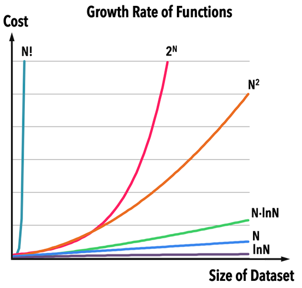

# Time Complexity
Describes the amount of time it takes to run an algorithm. Commonly expressed using asymptotic notation like **big O notation**, *O(n), O(1), O(log n)*, etc., where *n* is the input size.

## Asymptotic[[1](#note1)] Notation
A way to analyzing how fast a program's runtime grows asymptotically.
- O (Big-O): Worst case
- Ω (Big-Omega): Best case
- Θ (Big-Theta): Worst and best case are the same

### Example: Search Algorithm
- Linear search: O(n), Ω(1)
- Binary search: O(log n), Ω(1). (Search on a sorted array)
> Ex: Looking for **3** in [1, 2, 3, 4, 5, 6, 7]
>    1. [**1, 2, 3, 4**, 5, 6, 7],  3 < 4
>    2. [1, 2, **3**], 3 > 2
>    3. [**3**], 3 = 3
>
> Takes log2 8 = 3 times to find the target.

---

[1]: 漸進的