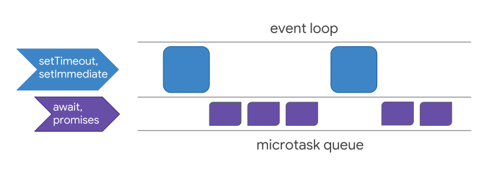

# Event Loop, (Macro)Tasks and MicroTasks

[[doc]](https://developer.mozilla.org/zh-TW/docs/Web/JavaScript/EventLoop) [[video]](https://www.youtube.com/watch?v=8aGhZQkoFbQ)

Javascript uses a single threaded runtime, but it has a concurrency model based on event loop.

## Glossary

- Stack: Function calls form a stack of frames. (Call stack)
- Heap: Objects are allocated in a heap which is just a name to denote a large (mostly unstructured) region of memory.
- Queue: A message(/event/task) queue. The processing of functions continues until the stack is once again empty. Then, event loop will process the messages in queue one by one.

## Event Loop

It's called this name because how it was implemented.

```js
while (queue.waitForMessage()) {
    queue.processNextMessage()
}
```

- Each message is processed completely before any other message is processed in FIFO order.
- Messages are added anytime an event occurs and there's an event listener attached to it, otherwise the event is lost.

For example, calling `setTimeout(listener, minimalTime)` will produce a message with `listener` which will be executed after `minimalTime`, not a guaranteed time. It's because `setTimeout` message has to wait for other messages to be processed.

## Task and MicroTask

[[doc]](https://jakearchibald.com/2015/tasks-microtasks-queues-and-schedules/) [[stackoverflow]](https://stackoverflow.com/questions/25915634/difference-between-microtask-and-macrotask-within-an-event-loop-context)



One go-around of the event loop will have exactly one task being processed from the __macrotask queue__ (this queue is simply called the __task queue__ in the [WHATWG specification](https://html.spec.whatwg.org/multipage/webappapis.html#task-queue)). After this macrotask has finished, all available __microtasks__ will be processed, namely within the same go-around cycle. While these microtasks are processed, they can queue even more microtasks, which will all be run one by one, until the microtask queue is exhausted.

- macrotasks:
  - `setTimeout`
  - `setInterval`
  - `setImmediate`
  - `requestAnimationFrame`
  - I/O
  - UI rendering
- microtasks:
  - `process.nextTick`
  - `Promises`
  - `async/await`
  - `queueMicrotask`
  - `MutationObserver`

### Quiz

```js
async function async1() {
    console.log('async1 start')
    await async2()
    console.log('async1 end')
}
async function async2() {
    console.log('async2')
}
console.log('script start')
setTimeout(function () {
    console.log('settimeout')
})
async1()
new Promise(function (resolve) {
    console.log('promise1')
    resolve()
}).then(function () {
    console.log('promise2')
})
console.log('script end')
```

### Answer

```js
script start
async1 start
async2
promise1
script end
async1 end
promise2
settimeout
```
